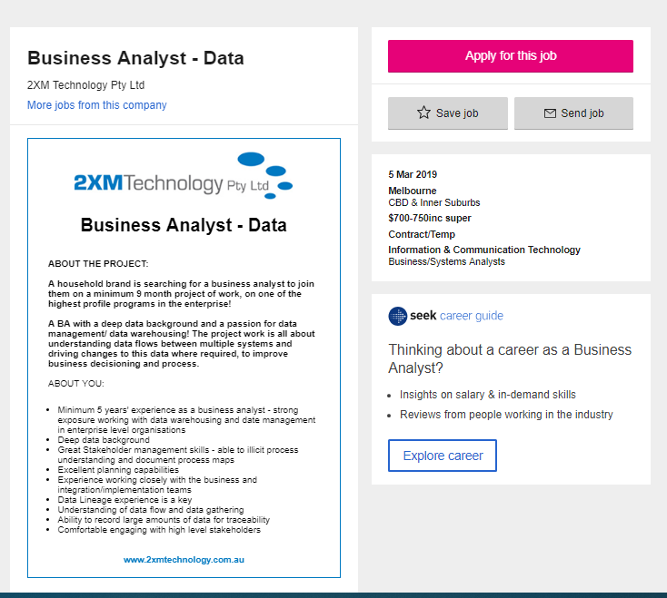
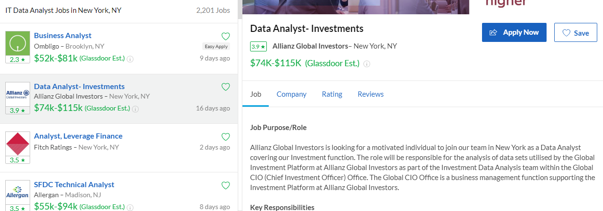
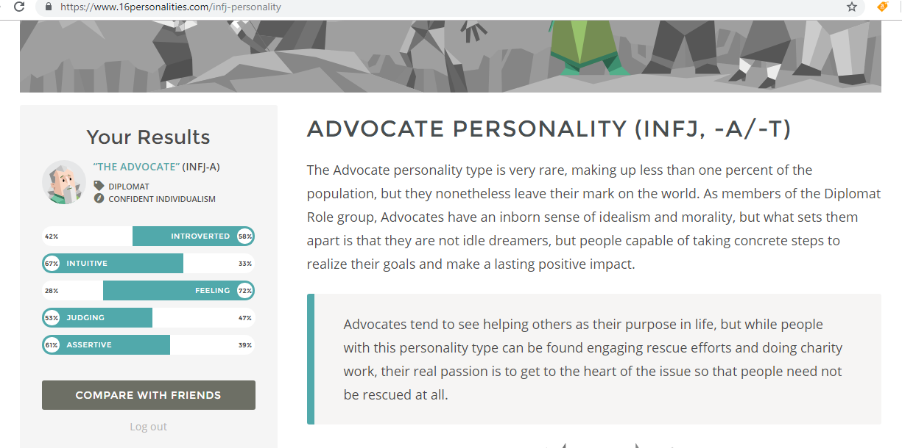
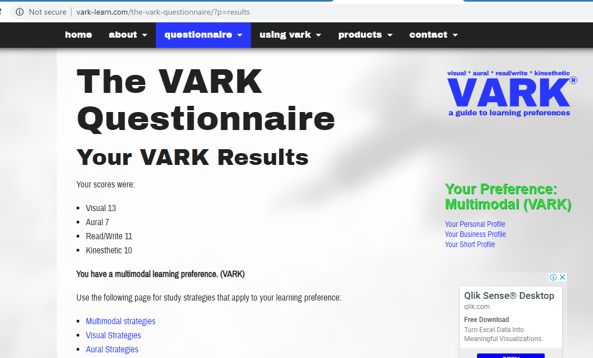
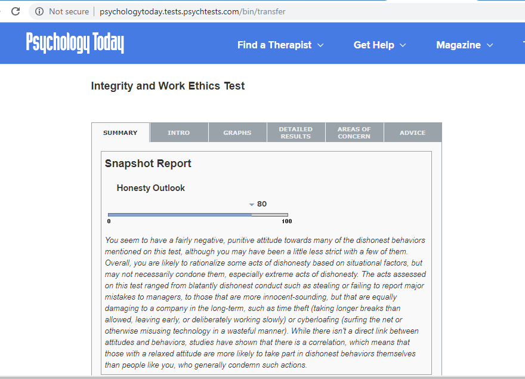

# About!
## My Story

‘Everything Happens for a reason’ – Fabulously cliché, yet so true! 

The Year was 2009! One cloudy day our lives would be changed forever! At the time my life was on path to success! I was studying hard and achieving fantastic grades at the University of the Sunshine Coast. I just received a job offer of a life time. The company was willing to sponsor me through the rest of my degree! Life was looking grand. I could nearly see the light at the end of the tunnel! The bright, luminous future career that was approaching and nearly within reach! Over half way through my degree and I could nearly taste the ripe and juicy benefits of having a stable income and career for my family!

‘BOOM!’ life threw me a curve ball! Driving home from a long day in lectures and tutorials I had a sharp pain in my leg. Within the hour I was in an ambulance on my way to hospital. Complications with my veins and arteries in my leg, which resulted in being bedridden for approximately 3 months! Lost my job! Left behind at uni. . .  Then another Boom next curve ball . . . And another Boom next curve ball!

Life passes you by while you are trying to survive! My family have pushed and struggled on and off for many years. However, it has made us stronger, more driven, passionate and now it is our turn to throw life the curve Ball ‘BOOM’! So here I am, enrolled and ready to submit my first assignment for introduction to IT at RMIT! 

It is hard to truly express how proud and excited it makes me to be back at University to gain my qualifications. My career goals have changed drastically since 2009 and hence my enrolment as an IT student.

Life may throw you some curve balls now and then, however you also end up exactly where you are meant to be! Due to all the curve balls and ups and downs, I have found a passion for the IT industry! The ability to work from home, plus the flexible hours have been great. The entry IT occupation I have had for the last few years has worked very well with my family life and health issues. This next adventure is about gaining the skills, knowledge and qualifications to enhance my career options in the IT industry. 

Welcome to My RMIT Profile!  

# Contact
Name: Karla Mc

Email: s3775612@student.rmit.edu.au

Location: Gold Coast, Queensland

# Interest in IT

Growing up I was privileged to have access to a computer as part of the family business. I was able to gain basic computer skills, to which I have improved over the years via general courses of study. This includes a diploma of project management, advance diploma of Social media management and previous university business subjects. These courses have enhanced my skill set, however it has all so created a passion to have a career in the IT industry. 

In 2009 I suffered a life altering health issue that enforced a career evaluation. During the last few years IT work has allowed me to work from home with flexible hours.   What is your interest in IT? 

My current enrolment at RMIT is the first step on my new pathway to gain a degree in IT Data Analysis. RMIT offered the best options for starting the journey towards the career I am wanting. 

While studying at RMIT, my expectations are to gain real-world knowledge, skills and understanding of the most current IT mechanisms, issues, solutions and functions.

## Ideal Career

Throughout my life, I was fortunate to be expose to a vast variety of opportunities and occupational experiences. During this time, I have come to discover a hunger for statistics, data patterns, project management and research. I have chosen the Ideal Career of an IT Data analysis, as the passions and current skill set is aligned with this career path. 

‘Data analysts translate numbers into plain English Every business collects data, whether it's sales figures, market research, logistics, or transportation costs. A data analyst's job is to take that data and use it to help companies make better business decisions.’ -
https://www.snagajob.com/job-descriptions/data-analyst/ 

### Ideal Job 1 Aus

https://www.seek.com.au/job/38494729?type=standout&searchrequesttoken=a91e7351-c479-4bab-a97b-d20d061860f3

### Ideal Job 2 USA 

https://www.glassdoor.com.au/Job/new-york-it-data-analyst-jobs-SRCH_IL.0,8_IC1132348_KO9,24.htm

There are several entry level jobs available across the world, making this a viable career option for myself. My soul yearns to travel this gorgeous planet, which has majorly influenced on my current career choice. IT data analysis is an increasingly domineering industry that is required across the globe.

To obtain even an entry level position as an IT data analysist, it is a requirement to understand particular programs such as SAP, excel, as well as many Data analytic programs. Throughout my university studies, I will increase the skills required to enter the industry and also have a degree to enhance my chance at employment. After 5 years’ experience in the role as a data analysist, I will be able to advance to a more senior roll.

The responsibility of a data analysist is to decipher the significate data from what is not relevant, while producing hypothetical solutions, predictions, and more efficient running systems and ideas.

# Personal Profile

## Myers-Briggs Personality test results
https://www.16personalities.com/infj-personality 

### INFJ –

I was fortunate to discover the Myers-Briggs Personality theory many years ago. It was interesting to have the same results even though I have grown and changed in major increments since taking the test last.  Looking into the career and team work abilities of an INFJ was insightful yet confirming of the strength and weaknesses I felt I already possessed. I have also been a hard worker, problem solver and thrive if the project is helping the world be a better place.

It is clear that I do not like confrontation and will do what needs to be done to dispel the opportunity of this occurring especially within a team environment. I will usual preconceive the potential for conflict between members before it becomes obvious to most. This allows me the ability to assist in resolving the issue before it affects the dynamics of the team. 

Being an introvert, I can take a back seat in a team environment, however when my ideas/ visions are in alignment with the objectives to complete a task, I am able to express this in a compassionate way. I will not struggle for power within a group, but able to couch, inspire and compromise, which is also great qualities if called upon to be a leader. I thrive in a peaceful environment with reciprocal respect, therefore, will seek team members that I respect, trust and can communicate well with.  

### VARK learning style test
http://vark-learn.com/the-vark-questionnaire/?p=results  

Throughout my learning journey, it has been evident that I am more a visual learning and do well with diagrams, list, mind mapping and project management charts. In a team environment my learning style means I will need to make lists and conduct maps of ideas, plans and construct working allocation charts that allow me not to become overwhelmed. This will enhance the productivity of the team with organizational skills while learning.  When forming a team, I will work well with others who are also able to use visuals, however it is not completely essential. 

### Integrity Test 
http://psychologytoday.tests.psychtests.com/bin/transfer

It was difficult to find a free online integrity test, however I found this test insulting and very basic. It did not consider working dynamics while making decisions regarding the integrity of others.

I believe I am a very honest person to which I hold a great level of pride in my high standards of integrity in all aspects of my life, work environment included. I have never stolen from anyone! I also have no time for others who choose to just take from others.

# Project Idea

## Overview 

### Emotional Regulator.

This project involves the development of an App that can be used not only by the account holder but all Support workers and or networks for those who suffer with emotional issues. This will help translate patterns in daily mental health issues and discover trigging situations that may worsen their current emotional regulation. This app will also allow support persons to prepare before arriving, assist accordingly and monitor the progression/ successfulness of implemented techniques. The app will be designed to support those suffering with chronic medical conditions. The emotional and stress levels of a diagnosed person can peek to extreme levels and in turn worsen symptoms and deepen mental health issues.

### Motivation

Chronic illness has become a global concern with it now affecting over 61% of the world’s population. Millions of people are affected by Chronic diseases, which shows the demand for such an app. This App would have the ability to help the emotional regulation of the suffering. It has been concluded that emotional regulation has an immense consequence on health choices. This includes areas of personal hygiene, diet and following through with treatment. 

Studies have shown that - ‘Overwhelming emotional demands deplete the resources needed for everyday self-care management of chronic disease, contributing to poor health outcomes.’ (Wierenga KL, Lehto RH, Given B, 2017 Aug)

### Description 

The app will implement visual cues to allow an easy to use, step by step data input method. While suffering from Chronic illness patients have less mental function to cope with complicated questions and or patience for intense and time-consuming tasks. 

The App will incorporate an alarm setting to allow a reminder for information input. It will be a quick and easy multiple-choice questionnaire with visual cues. The process will only have a several steps that can be done on the go and at any location. The information input will be saved to the device and once internet connection is established the data will also be saved to a secured remote server. 

As the information is submitted and saved it will also be accessible by the supporting network teams that have permission. Allowing supporting professionals access to the emotional state of their client will aid in the preparation of the next appointment. The input data can be examined and suggest different techniques and recommendation of more support professionals that may be required.  This data can also assist in the discovery of trigging factors that may be not only affecting the emotional state of the patient but increasing symptoms.  The app will also be able to show any correlation between the emotional regulation and the effects of any current treatment.  
The product will allow the user to personalise the face of the app, allowing charge of colour choices, different style layouts and the ability to secure the app with a password. 

The diagram below is the early stage design of the first step. This is one of the visual cues that will establish an easy to use grading of their emotional state at the time. Once the patient answers the simple questions regarding emotional state it will be able to suggest techniques that have previously saved in the app by either the patient and or the support professionals working with the client. The encouragement to utilise pre-set techniques is an essential feature of the App. This is subsequently because the fact when someone is overwhelmed by their environment it becomes difficult to recall the techniques required to assist in their emotional regulation. 

.jpg)

The App will be designed to benefit the user! Once a pattern is established it is easier to find and implement solutions!

### Tools, skills and Technologies

There are many software and programs available to help build and construct your first App, such as Xcode and Swift. However, to create this app, there will be the requirement of advance skills in programming, software coding, internet and serve security, photoshop, website design and legal assistance. Guaranteeing information protection is essential as this app will store and allow consent sharing of medical and personal information.

The skills, knowledge and network of professionals to produce this app will be attained over the next 3 years during my IT degree. The funding will primarily to be required thought investment, sponsorship and or shared contribution of shareholders or project benefactors. The production of this app is feasible as a long-term project. This App is evident of being a high-yielding investment due to the fact it could be contributing to better daily living for over 4 billion people who suffer with Chronic diseases around the world.  

### Outcome

This App has the potential to successfully help the emotional regulation of chronic illness sufferers, which in turn would increase their likelihood of survival, boost treatment recovery, and surge better health outcomes globally. Chronic illness is a serious and global epidemic. It has been proven that emotional regulation can strongly affect anyone and especially those that are in chronic pain, unwell or suffering daily. This App will be designed to benefit the world one Chronic sufferer at a time.

# Reference

## Online Quiz’s 

###Personality test

   •	NERIS Analytics Limited 2019, 16 personalities, 2011-2019 NERIS Analytics Limited, viewed 5th March 2019, https://www.16personalities.com/infj-personality
   
### Learning tests

   •	SOAR Learning Inc 2019, How to Study, Arc Seven Technology, Viewed: 10th March 2019, https://www.how-to-study.com/learning-style-assessment/
   
  •	Psychology Today 2019, Multiple Intelligences & Learning Style Test, Sussex Publishers LLC, viewed: 10th March 2019, https://www.psychologytoday.com/au/tests/iq/multiple-intelligences-learning-style-test
  
  •	VARK Learn Limited 2019, The VARK Questionnaire How Do I Learn Best? VARK Questionnaire version 7.1, Viewed 10th March 2019 http://vark-learn.com/the-vark-questionnaire/?p=results
  

### Other tests 

  •	Psychology Today 2019, Integrity and Work Ethics Test, Sussex Publishers LLC, viewed: 10th March, 2019, http://psychologytoday.tests.psychtests.com/bin/transfer/
  

### Documents 

  •	Australian Institute of Health and Welfare 2018, Australia’s health 2018. Australia’s health series no. 16. AUS 221. Canberra: AIHW, viewed 1oth March 2019 https://www.aihw.gov.au/getmedia/6bc8a4f7-c251-4ac4-9c05-140a473efd7b/aihw-aus-221-chapter-3-3.pdf.aspx
  
  •	Australian Institute of Health and Welfare 2014 Australia’s health 2014, Australia’s health series no. 14. Cat. no. AUS 178. Canberra: AIHW, viewed 1oth March 2019 https://www.aihw.gov.au/getmedia/8f7bd3d6-9e69-40c1-b7a8-40dca09a13bf/4_2-chronic-disease.pdf.aspx
  
  •	World Health Organization 2014, Chronic diseases and health promotion, WHO, Viewed 10th March 2019,  https://www.who.int/chp/countries/en/
  
  •	World Health Organization 2019, Overview - Preventing chronic diseases: a vital investment,  WHO, Viewed 10th March 2019, https://www.who.int/chp/chronic_disease_report/part1/en/index3.html
  
  •	World Health Organization 2014, The global burden of chronic, WHO, Viewed 10th March 2019, https://www.who.int/nutrition/topics/2_background/en/
  
  •	Wierenga KL, Lehto RH, Given B 2017, Emotion Regulation in Chronic Disease Populations: An Integrative Review, US National Library of Medicine National Institutes of Health, viewed: 10th March 2019, https://www.ncbi.nlm.nih.gov/pubmed/28793948
  
  •	Reinder de Vries June 2018, How To Make An App (In 9 Steps), LearnAppMaking.com 2019 viewed: 5th March 2019 https://learnappmaking.com/how-to-make-an-app/

